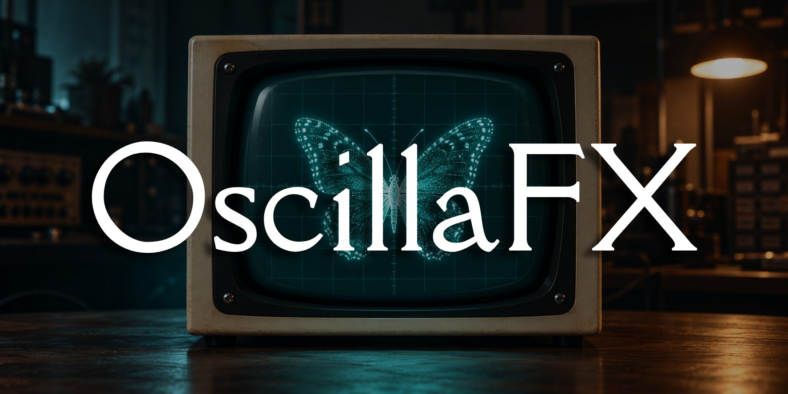
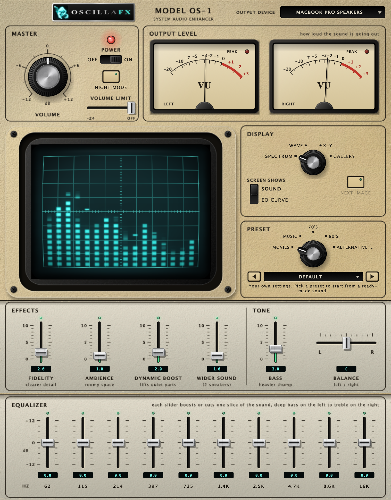
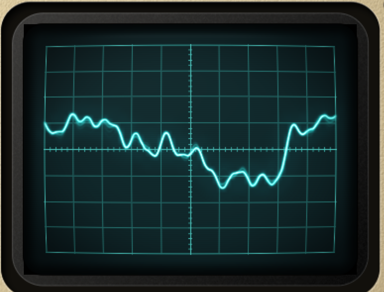
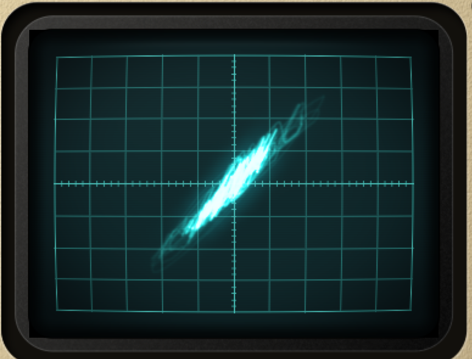
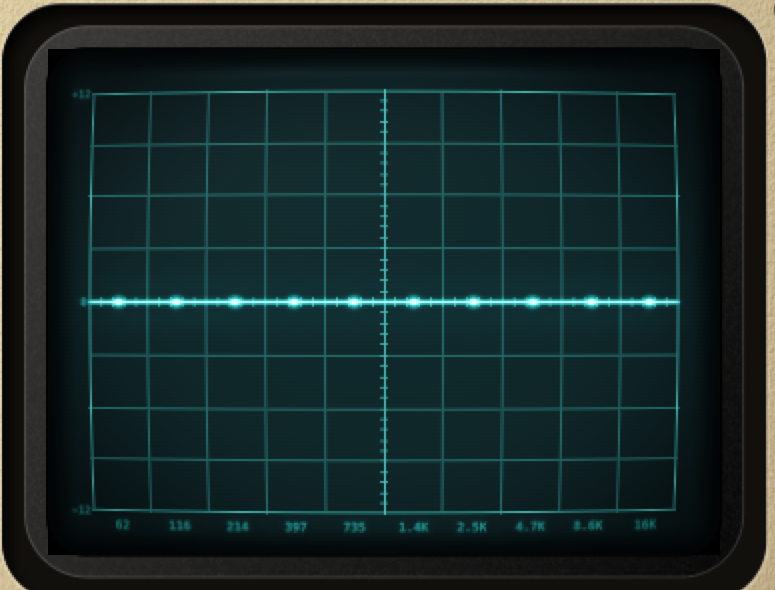
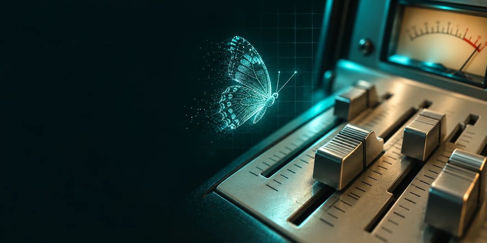

<p align="center">
  
</p>

<h1 align="center">OscillaFX</h1>

<p align="center">
  <b>System-wide audio enhancement, native on macOS.</b><br>
  An open-source, FxSound-style equalizer and sound enhancer for your Mac, with a retro CRT oscilloscope front panel.
</p>

<p align="center">
  
  
  
  
</p>

---

## Why OscillaFX?

[FxSound](https://github.com/fxsound2/fxsound-app) is a great open-source sound enhancer, but it only runs on **Windows**.
**OscillaFX brings the same DSP engine to the Mac, natively.** Install it once and every app on your Mac
(Music, Spotify, YouTube, Netflix, games, calls) goes through your own EQ and effects before it reaches your
speakers or headphones.

- **Built for macOS.** A real Core Audio virtual device, a native universal app (Apple silicon and Intel), a menu bar item,
  Dock and login-item support. No Windows emulation, no web wrapper.
- **The FxSound sound.** The original FxSound DSP engine (Fidelity, Ambience, Dynamic Boost, Surround, Bass, 10-band EQ)
  and its presets, ported to macOS.
- **Settings that follow your device.** Headphones, speakers, AirPods and displays each remember their own sound. Change
  something on your headphones and your speakers stay exactly as they were.
- **A front panel you will actually enjoy.** Cream instrument plastic, analog VU meters, slide faders and a teal phosphor CRT
  that draws your music.
- **Free and open source.** AGPL-3.0. Read it, change it, build it yourself.

## Screenshots

<p align="center">
  
</p>

| Waveform | X-Y (stereo phase) | EQ curve |
|---|---|---|
|  |  |  |

<sub>Screenshots are taken from the app's UI preview build with a synthetic test signal.</sub>

## Features

**Sound**
- 21 presets, including **Movies** (deep clean bass, clear dialogue) and **Music** (punchy bass, open highs, wide stereo),
  plus the FxSound bonus presets.
- Effects: **Fidelity**, **Ambience**, **Dynamic Boost**, **Wider Sound (2 speakers)** and **Bass**, plus balance and a volume knob.
- **10-band graphic equalizer** with classic hi-fi slide faders.
- **Night mode** evens out loud and quiet parts. A **volume limit** caps the loudest sound to protect your ears.

**Per-device profiles**
- Every output device keeps its own settings, saved automatically and switched when you change device.
- **New-device suggestions:** the first time you use a device, OscillaFX offers *Flat, Warm, Bass-heavy, Voice* or *Wide*
  starting sounds tuned for that kind of device (laptop speakers, headphones, Bluetooth, AirPods, displays). Nothing changes
  until you choose.

**Display**
- A teal phosphor CRT with four modes: **spectrum**, **waveform**, **X-Y** and a **gallery** of phosphor pictures
  (add your own, with an optional slideshow that pulses with the bass).
- Two analog **VU meters** with real needle ballistics and peak lamps.
- Plain-language labels and a one-line hint on every control; keyboard and VoiceOver support.

**Reliability**
- Restores your real output device when you quit, and a small **crash watchdog** does the same if the app is force-quit or
  crashes, so your Mac never stays silent.
- Only takes over the system output after you grant microphone access, and gives it back if no audio arrives.
- Drift-corrected capture/playback (two devices, two clocks), lock-free audio thread.

## Install

> Requires **macOS 13 (Ventura) or later**. Developed and tested on an Apple silicon Mac running macOS 27.
> Other macOS versions are untested.

1. Download `OscillaFX-<version>.pkg` from the [latest release](../../releases/latest).
2. **Quit eqMac, FxSound, Boom, SoundSource** or any other system audio enhancer. Two enhancers fight over the default device.
3. Double-click the `.pkg`. It installs `OscillaFX.app` and the **OscillaFX Audio** virtual device, and restarts Core Audio
   (sound drops for about two seconds, no reboot).
4. Because the package is not signed with a paid Apple Developer ID, macOS will warn you:
   right-click the `.pkg` and choose **Open**, or use **System Settings → Privacy & Security → Open Anyway**.
5. Open **OscillaFX** and **allow microphone access** when asked. That permission is how macOS lets the app read
   the OscillaFX Audio virtual device. Your real microphone is never used and nothing is recorded.

Full instructions, uninstall steps and troubleshooting: [docs/INSTALL.md](docs/INSTALL.md).

**Uninstall:** `packaging/uninstall.sh` (add `--purge` to also delete your saved profiles).

## How it works

```
 any app  ──►  "OscillaFX Audio" virtual device (system default output)
                    │  Core Audio capture
                    ▼
            drift-corrected ring buffer ──► DfxDsp (FxSound engine) ──► night mode / limiter
                                                                              │
                                                                              ▼
                                                              your real speakers / headphones
```

1. A Core Audio **HAL plug-in** (a fork of BlackHole, GPL-3.0) provides the virtual output device.
2. OscillaFX makes it the system output, captures it, and processes the audio with the **FxSound DSP engine**.
3. The result is played on the real device you chose. A drift-compensating resampler keeps the two clocks in step.
4. On quit (or crash, via the watchdog) the real device becomes the system output again.

## How it was made

OscillaFX started from the open-source FxSound for Windows code base:

- **DSP engine** (`engine/`): FxSound's `DfxDsp` ported to macOS with a small Windows compatibility shim. Porting issues fixed along
  the way include Windows' 32-bit `long`, uninitialised legacy state and MSVC `swprintf` semantics. It is covered by offline tests
  (finite output, bass boost direction, bit-exact bypass, preset measurements for loudness, voice clarity and stereo width).
- **Audio engine** (`app/Source/audio`): two raw Core Audio IOProcs, a lock-free SPSC ring, a Hermite drift resampler, a triple buffer
  to hand settings to the audio thread, default-device switching and volume mirroring.
- **Driver** (`driver/`): BlackHole, rebranded through a build-time patch (the upstream clone stays untouched).
- **UI** (`app/Source/ui`): JUCE 8 with everything drawn in code. The CRT runs on the GPU with Metal (with a CPU fallback):
  phosphor persistence, bloom and a lens pass, with a clean thin trace.
- **Packaging** (`packaging/`): a universal, ad-hoc signed `.pkg` built with `pkgbuild`/`productbuild`.

The project was developed with AI assistance (Anthropic's Claude Code) under human direction and review.

## Build from source

```bash
git clone --recurse-submodules https://github.com/evernoxxx/OscillaFX.git
cd OscillaFX

# build + tests
cmake -S . -B build -DCMAKE_BUILD_TYPE=Release
cmake --build build -j8
./engine/run_tests.sh                 # DSP + preset tests
ctest --test-dir build                # engine, CRT trace and DSP tests

# universal app + driver + installer (dist/OscillaFX-<version>.pkg)
packaging/build_release.sh
```

Needs Xcode Command Line Tools and CMake 3.22 or later. Details are in [docs/INSTALL.md](docs/INSTALL.md) and
[docs/BACKEND_API.md](docs/BACKEND_API.md). The brand assets are regenerated by `assets/brand/make_logo.py`
([docs/BRAND.md](docs/BRAND.md)).

### Project layout

| Path | What |
|---|---|
| `app/Source/core` | settings, per-device profiles, presets, suggestions, gallery store |
| `app/Source/audio` | Core Audio engine, ring buffer, resampler, dynamics, crash watchdog client |
| `app/Source/ui` | panel, faders, VU meters, Metal CRT renderer |
| `engine/` | FxSound DSP port, shim, offline tests and preset tools |
| `driver/` | BlackHole-based virtual audio device (build scripts and branding patch) |
| `helper/` | crash watchdog helper |
| `packaging/` | installer scripts, distribution, uninstaller |
| `presets/`, `presets_fxsound/` | OscillaFX presets, FxSound bonus presets |

## Known limitations

- The installer is **not notarized** (no paid Apple account), so macOS shows a warning on first open.
- The driver and the self-signed app have only been tested on one Mac. Reports from other macOS versions are welcome.
- "Wider Sound" and the Music preset widen the stereo image. They do not create real surround sound from two speakers.
- Apps that play copy-protected audio may bypass system audio capture.
- Because the app is ad-hoc signed, macOS may ask for microphone permission again after each update.

## Contributing

Issues and pull requests are welcome. Please run `./engine/run_tests.sh` and `ctest --test-dir build` before you open a PR.
Keep the audio thread free of allocations, locks and logging, and do not use `long` in `engine/` (use `int`/`int64_t`).

## Credits and licenses

OscillaFX is licensed under the **GNU Affero General Public License v3.0** ([LICENSE](LICENSE)).
It is built on:

- **[FxSound](https://github.com/fxsound2/fxsound-app)** (AGPL-3.0), the DSP engine and bonus presets.
- **[BlackHole](https://github.com/ExistentialAudio/BlackHole)** (GPL-3.0), the virtual audio driver.
- **[JUCE](https://juce.com)** (AGPL-3.0 option), the application framework.

See [NOTICE.md](NOTICE.md) for details. OscillaFX is an independent project. It is not affiliated with or endorsed by FxSound LLC,
Existential Audio, Apple or any instrument maker whose design inspired the look. Names and trademarks belong to their owners.

The bundled gallery pictures are included as demo content. If you are a rights holder and want a picture removed, please open an issue.

<p align="center"></p>
